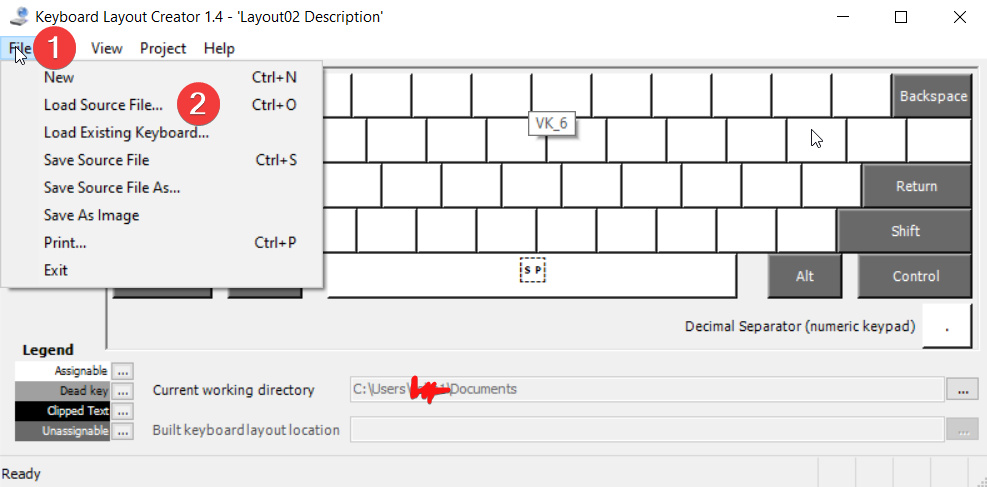
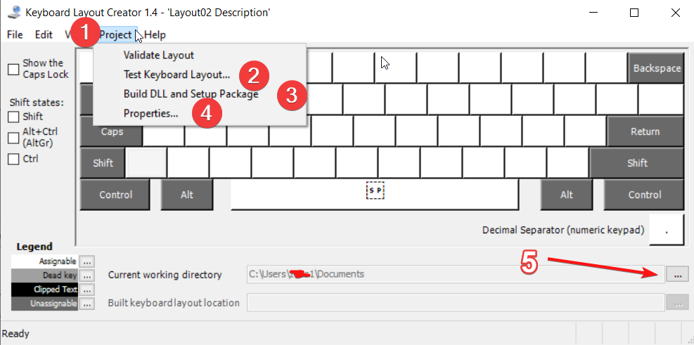
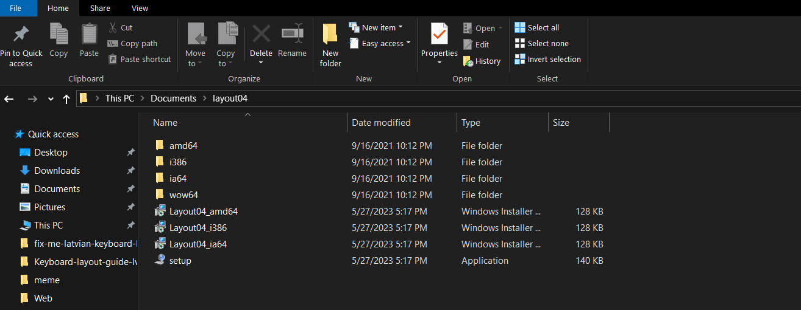
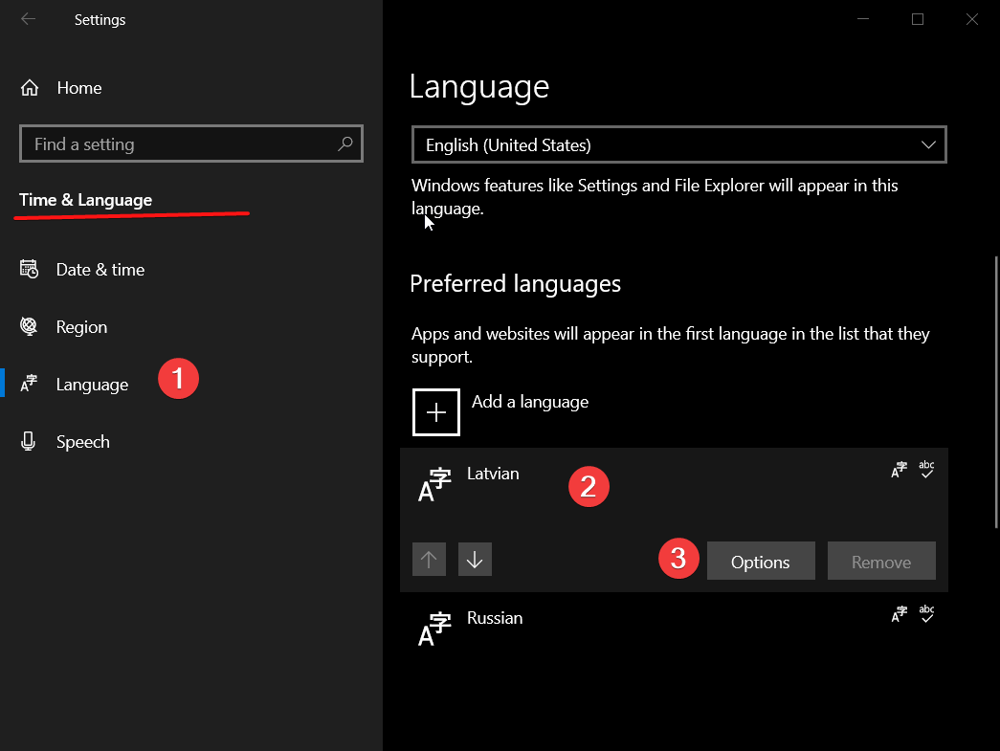
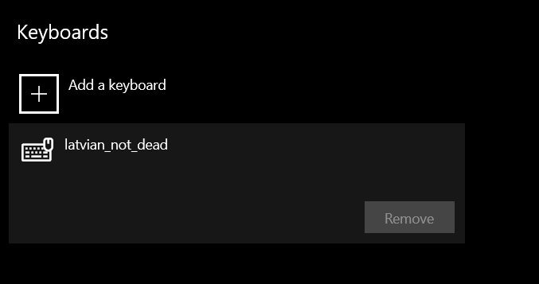
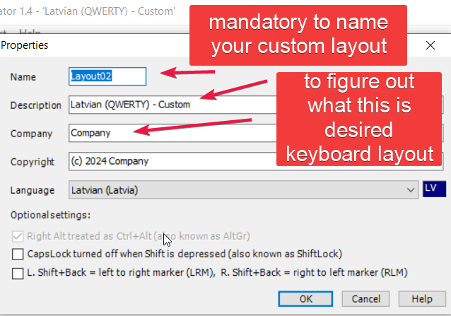

# About

Содержит в себе шаги по установки кастомной латышской раскладки для windows 10/11

Satur sevī soļus, ka instalēt CUSTOM latviešu valodas tastāturu priekš windows 10/11

Contains itself guide how to install Custom Latvian keyboard layout for windows 10/11

Table of content/Cправочник/Kontenta pārskāts

- [LV valoda](#lv)
  - [Ko vajag installēt pirms soļiem](#ko-vajag-installēt-pirms-soļiem)
  - [Soļi, lai instalētu fiksu](#soļi-lai-instalētu-fiksu)
  - [Papildus iestastījumi, ko var mainīt](#papildus-iestastījumi-ko-var-mainīt)
  - [Attinstalēt izkārtojumu](#attinstallēt-izkārtojumu)
- [On English](#en)
  - [Preconditions](#preconditions)
  - [Steps to apply fix](#steps-to-apply-fix)
  - [A11L settings to apply](#a11l-settings-to-apply)
  - [Uninstall Custom layout](#uninstall-custom-layout)
- [На Русском](#ru)
  - [Что надо установить](#что-надо-установить)
  - [Шаги по установке фикса](#шаги-по-установке-фикса)
  - [Доп настройки](#доп-настройки)
  - [Деинсталировать Кастомную латышскую раскладку Custom layout](#деинсталировать-кастомную-латышскую-раскладку-custom-layout)

## LV

### Ko vajag installēt pirms soļiem

- MSKLC no MS un to installēt uz sava PC [Links](https://www.microsoft.com/en-us/download/details.aspx?id=102134)
- Lejuplādēti faili no šī repozitorija. Priekš visam darbībam vajag fails ar .klc paplašinājumu

### Soļi, lai instalētu fiksu

1. Installēt uz sava datora MSKLC un lejuplādet šī repozitorija failus
2. Palaist programmu MSKLC
3. Atvert tabu ar nosaukumu `File`(1) un izvelēties`Load Source File..`(2)
    

4. Paradīsies pop out logs un tāja ir jāizvēlas `latvian_not_dead.klc` fails. Tādējādi šinī programmā tiks ieladēts Latviešu valodas tastāturas fiks.
5. Kad tiks ieladēts valodas izkartojums(solis.4) tad vajag atvert tabu ar nosaukumu `Project`(1) un paradīsies izvelne, lai notestētu šo fiksu tad var izvelēties `Test Keyboard Layout` (2). Izvēloties šo iespēju atversies jauns logs un šajā lgoa var notestēt, ka darbojas izkartojums.  Izvelnēs punkts (4) jeb `Properties` ļauj veikt tekoša izkartojuma papildus modifikācijas, skat sadaļu, ko var modificēt.
6. Izvelēties no izvēlnes `Project`(1) opciju `Build DLL and Setup Package`(3)  tiks palaists process, kur tiks radīti faili, lai varētu installēt izkartjomu. Šie faili būs vajadzīgi, priekš fiksa instalācijas. Papildus info ar  (5) ir atzīmēta poga, uzspiežot, kuru var izmainīt default ceļu , kur tiks radīti faili.
    

7. Atvert mapi/direkotiju, kur tika pēc soļa 6. radīti faili. Bilde ir paradīts, kā izskatas faili, ko radīja MSKLC programma.

8. Palais failu ar nosaukumu `setup.exe`, šīs izpildfails palaiž programmu, lai uz Jūsu datora tiktu instalēts jauns Custom izskārtojums.
    

9. Kad installācija pabeigta, tad vajag restartēt datoru. Tikai pēc datora restarta varēs ieraudzīt tastāturas izkartojuma izvelnē tik tikko radītu Custom izkartojumu.
10. Atvert datora iestastījumus. Start → Settings -> Time&Language un izvelēties tabu `Language`(1)
11. Izvelēties tekošas latviešu valodas izkārtojumu `Latvian`(2)  un piespiest pogu `Options`(3)
    

12. Atversies jauns logs, kur logā vajag piespies pogu `Add Keyboard` . Atversies saraksts. Saraksta ir jāizvelas tastāturas izkartojumu, ko tikko esat instalējuši( ja tika izmantoti mani faili un neizmainot to iestastījumos tas paradīsies latviešu valodas izkartojums ar aprakstu -’’Latvian not dead’’).
    

13. ??????
14. PROFIT

### Papildus iestastījumi, ko var mainīt

  
Papildus iestastījumi, ko var izmainīt priekš konkrēti ši CUSTOM tastāturas izkartojuma. Obligāts lauks ir izkārtojuma nosaukums.

### Attinstallēt izkārtojumu

Atvert mapi kura tika radīti faili priekš CUSTOM izkārtojuma un velreiz palaist exe failu. Izvēlne izvēlēties `uninstall layout`.

## EN

### Preconditions

- MSKLC from MS here is [link]((https://www.microsoft.com/en-us/download/details.aspx?id=102134))
- Files from this repo , only need .klc file. To download repo use download zip

### Steps to apply fix

1. Install MSKLC and download this repository
2. Open MSKLC app
3. Click on `File`(1) tab and in opened dropdown select`Load Source File..`(2)
    

4. In pop out windows select `latvian_not_dead.klc` file. Bassically .klc file is template to create files what are fix to latvian keyboard layout.
5. When layout template will be loaded to app then need to click on  `Project`(1) tab. After click will appier dropdown with options. To test my layout without installation on you machine select `Test Keyboard Layout` (2). Choosing this option will appier dropdown windows and you can type Latvian latters to test if it actually works.  In dropdown of Project option  `Properties` allows you to make some additional configuration for this layout. Mostly cosmetics...
6. Click on tab`Project`(1) select option `Build DLL and Setup Package`(3)  this will launch process of creating files needed to apply my fix. These files will be needed for installation of the fix. Wait until it finishes.  A11l information using button(5)  you can change MSKLC current working directory. Files created in this step will appier in your MSKLC current working directory.
    

7. Open MSKLC working directory or where you set files will be outputed from step 6.  In picture you could see how these files what was created by MSKLC in step 6. looks like.
8. Launch`setup.exe`. This file will launch installation of my keyboard layout on you machine.
    

9. Then the installation is finished need to reboot your machine only after reboot windows will see what new keyboard layout was added.
10. Open windows setings. Start → Settings -> Time&Language and select tab wiht label  `Language`(1)
11. Select ‘Latvian’(2) option in Preffered languages menu and click on`Options`(3) button. New window will appier.
    

12. In the window you can add or remove keyboard layouts for specific language. In this case it is Latvian. Click on`Add Keyboard` as a result will appier dropdown. In this list select your newly installed in step 8. Custom Latvian Keyboard layout. If you did not changed anything in a11l settings tab then in `Add Keyboard` dropdown will be option with name/description = ’Latvian not dead’’. Select it. And you have my fix on your PC. To avoid anoyance delete MS provided Latvian keyboard layout.
    

13. ??????
14. PROFIT

### A11L settings to apply

Additional settings what could be set for this keyboard layout/ Mandatory field iz name of the layout.  

### Uninstall Custom layout

Open directory from step 7. and lauunch .exe file.

## RU

### Что надо установить

- MSKLC от майкрасофта, скачать можно [здесь](https://www.microsoft.com/en-us/download/details.aspx?id=102134)
- Файлы из этого репозитория- klc файл в частности

### Шаги по установке фикса

1. Установлен MKLC и скачены файлы из репозитория
2. Открыть программу MKLC
3. Открыть таб File и выбрать пункт Load Source File..(2)
    

4. В открывшимся окне выбрать файл `latvian_not_dead.klc`. Таким образом в программу будет загруженна раскладка с фиксом
5. Когда раскладка была загружена, то нажать на вкладку Project(1) и покажеться меню выбора. Чтоб протестить как работает раскладка то можно кликнуть (2) в открывшимся окне можно протестировать как работает раскладка. (4) Изминить название раскладки и доп информация(почта, название раскладки, описание и т.д)
6. Выбрать `Build DLL and Setup Package`(3) будут созданы файлы раскладки для вашего ПК. (5) Нажав на эту кнопку можно выбрать свой путь для файлов что будут созданы вместо того что идёт по дефолту.
    

7. Открыть директорию куда были созданы файлы раскладки(в MKLC это дефолтный путь – Current working directory) ниже показанно как выглядит директории и файлы что создала программа
8. Запустить экзешкник под названием setup.exe
    

9. Рестартнуть ПК
10. Открыть настройки . Пустк -Settings-> Time&Language и выбрать Language
11. Выбрать язык раскладки(2) и нажать опции(3)
    

12. В октрывшимся меню нажать Add Keyboard и там выбрать Раскладку что установили(если использовали мои файлы то название раскладки будет Latvian not dead)  
    

13. ??????
14. PROFIT

### Доп настройки

  
Настройка раслкадки под себя где можно изменить название раксладки(обезательное поле), описание, Компания и копирастия

### Деинсталировать Кастомную латышскую раскладку Custom layout

Открыть директорию из шага 7. Запустить .exe файл. В появившемся окне выбрать опцию `uninstall layout` и нажать далее. Установщик удалит раскладку из вашего ПК.
